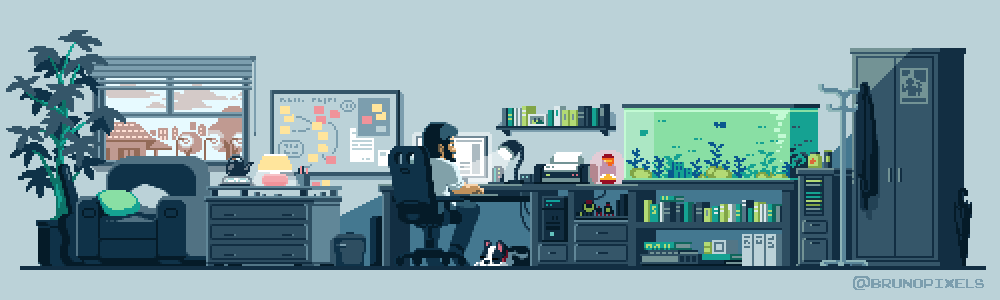

<!-- Header Neon phát sáng với font Alfa Slab One -->

  

<!-- Social Connect Badges -->

  
  
  

  

---

### 🛠️ Architecture & Core Technologies

<b>Frontend Ecosystem</b>

  

<b>Backend & Core Languages</b>

  

<b>Databases & Cloud Storage</b>

  

<b>DevOps, Cloud & Tooling</b>

  

---

### 📈 Activity & Insights

  
  

 

  

---

  

